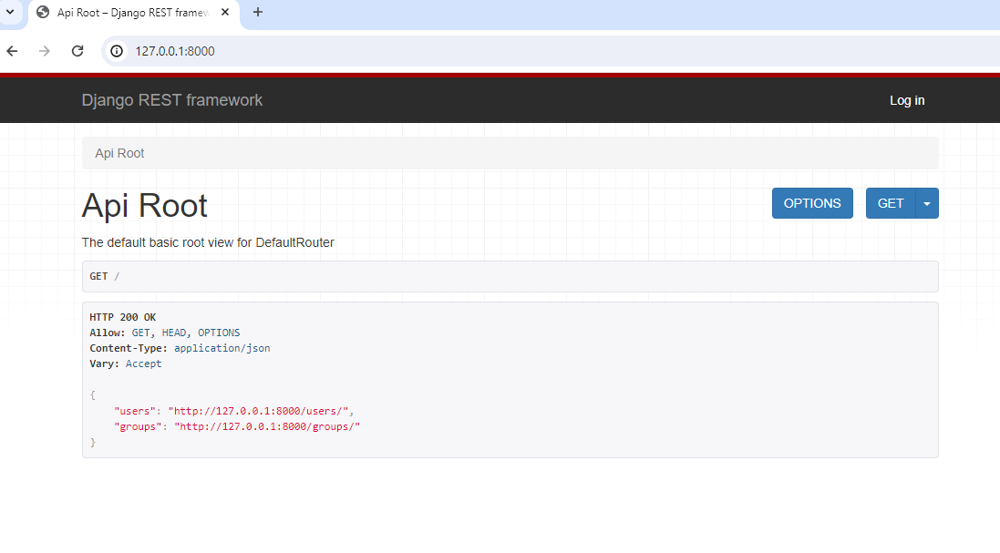

# start-Django-REST-framework

13/01/2022

source:
https://django.fun/docs/django-rest-framework/ru/3.12/tutorial/quickstart/

## 1. i. Запуск тестового сервера разработки Django REST локально (Windows 10)

В оболочке cmd (не PowerShell):

&gt; ```git clone https://github.com/vakhnin/start-Django-REST-framework.git``` <br>
&gt; ```cd .\start-Django-REST-framework\``` <br>
start-Django-REST-framework&gt; ```python -m venv venv``` <br>
start-Django-REST-framework&gt; ```.\venv\Scripts\activate.bat``` <br>
(venv) start-Django-REST-framework&gt; ```python.exe -m pip install --upgrade pip``` <br>
(venv) start-Django-REST-framework&gt; ```pip install -r requirements.txt``` <br>
(venv) start-Django-REST-framework&gt; ```python manage.py migrate``` <br>
(venv) start-Django-REST-framework&gt; ```python manage.py runserver``` <br>

Будет запущен сервер, доступный в браузере по адресу `http://127.0.0.1:8000/`



Остановка сервера: `Ctrl-C`

Повторный запуск тестового сервера:

(venv) start-Django-REST-framework&gt; ```python manage.py runserver``` <br>

Тестировалось с Python 3.12

## 1. ii. Запуск тестового сервера разработки Django REST локально (Ubuntu 20.04)

$ ```sudo apt update``` <br>
$ ```sudo apt install git python3-venv -y``` <br>
$ ```git clone https://github.com/vakhnin/start-Django-REST-framework.git``` <br>
$ ```cd start-Django-REST-framework/``` <br>
start-Django-REST-framework$ ```python3 -m venv venv``` <br>
start-Django-REST-framework$ ```source venv/bin/activate``` <br>
(venv) start-Django-REST-framework$ ```pip3 install -U pip``` <br>
(venv) start-Django-REST-framework$ ```pip3 install -r requirements.txt``` <br>
(venv) start-Django-REST-framework$ ```python3 manage.py migrate``` <br>
(venv) start-Django-REST-framework$ ```python3 manage.py runserver``` <br>

Будет запущен сервер, доступный в браузере по адресу `http://127.0.0.1:8000/`


Остановка сервера: `Ctrl-C`

Повторный запуск тестового сервера:

(venv) start-Django-REST-framework&gt; ```python manage.py runserver``` <br>
